# GPS/RTK Kinematic定位分析报告【北云 BEIYUN M21 · GNSS/INS组合惯导】

## 基本信息
- **分析输入(COM3/ASCII)**: 0916星扬下午.dat
- **生成时间**: 2026-09-17 19:29:47
- **分析工具**: 北云 BEIYUN M21 Kinematic Analyzer

## 1. 数据概览

| 报文类型 | 数量 | 占比 |
|---------|------|------|
        | #TRACKSTATA | 7267 | 4.7% |
| #INSPVAXA | 14532 | 9.4% |
| #BESTPOSA | 7266 | 4.7% |
| $GPGGA | 7266 | 4.7% |
| $GPGSV | 18581 | 12.1% |
| $GLGSV | 14512 | 9.4% |
| $GAGSV | 14142 | 9.2% |
| $GQGSV | 7266 | 4.7% |
| $GBGSV | 34084 | 22.1% |
| $GPGSA | 7251 | 4.7% |
| $GPGST | 7266 | 4.7% |
| #BESTGNSSPOSA | 7266 | 4.7% |
| #HEADINGA | 7266 | 4.7% |

**数据完整性**: 153965 条有效报文(原始 299287 行, 乱码残片 0 行)

        
## 2. 完整性检查与报文周期核对(ICOM3配置)

| 报文 | 条数 | 设定周期(s) | 实际周期(s) | 实际频率(Hz) | 丢帧率 | 状态 | 备注 |
|------|------|------------|------------|-------------|--------|------|------|
| #BESTPOSA | 7266 | 1.000 | 0.200 | 5.00 | 0.0% | 🟡提示 | 设定1.0s, 实测通常0.2s(输出更密); 该报文已不再使用, 仅信息提示 |
| #INSPVAXA | 14532 | 0.100 | 0.100 | 10.00 | 0.0% | 🟢正常 | - |
| $GPGGA | 7266 | 1.000 | 0.200 | 5.00 | 0.0% | 🟡提示 | 设定1.0s, 实测通常0.2s(输出更密); 实际输出比设定更频繁, 不影响使用, 仅信息提示 |
| #BESTGNSSPOSA | 7266 | 0.200 | 0.200 | 5.00 | 0.0% | 🟢正常 | - |
| #HEADINGA | 7266 | 0.200 | 0.200 | 5.00 | 0.0% | 🟢正常 | - |
| $GPIMU | 145322 | 0.010 | - | - | - | 🟡提示 | 按用户要求放弃处理, 仅计数显示 |
| $GPGSV | 18581 | 0.100 | - | - | - | 🟢正常 | 无可用时间戳, 按报文插入规律推断(以实测数据为准) |
| $GPGSA | 7251 | 0.100 | - | - | - | 🟢正常 | 无可用时间戳, 按报文插入规律推断(以实测数据为准) |
| $GPGST | 7266 | 0.100 | - | - | - | 🟢正常 | 无可用时间戳, 按报文插入规律推断(以实测数据为准) |
| #TRACKSTATA | 7267 | 0.200 | 0.200 | 5.00 | 0.0% | 🟢正常 | - |

> ⚠️ 加粗标色项表示实际报文周期与设定周期可能不符或报文缺失, 请核对设备输出配置。

### ICOM4 关注项(静态相关)
- RANGECMPB ONTIME 0.2s (二进制, 原始观测值压缩格式; 当前程序未实现二进制解码)

**采样率分析**: 5.00 Hz (平均间隔: 0.200 秒)

        **RTK链路**: 基站ID 1793(核对7216次) ／ 差分龄期 平均1.20s, 最大5.40s

## 3. GNSS解类型分析

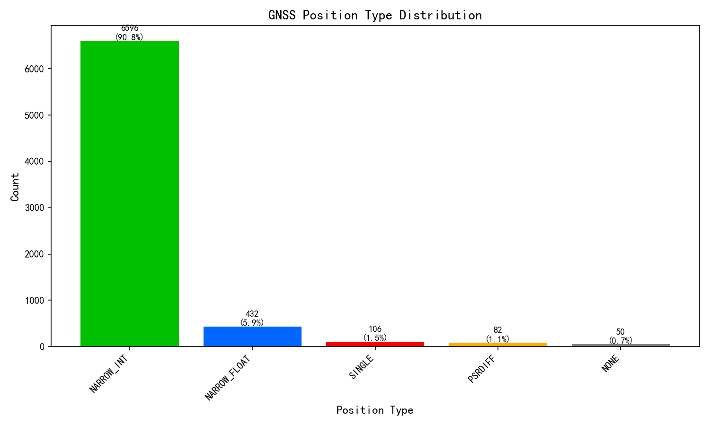

| 解类型 | 数量 | 占比 |
|--------|------|------|
| NARROW_INT | 6596 | 90.8% |
| NARROW_FLOAT | 432 | 5.9% |
| SINGLE | 106 | 1.5% |
| PSRDIFF | 82 | 1.1% |
| NONE | 50 | 0.7% |

**GNSS固定解比率**: 90.8%

## 4. INS解类型分析

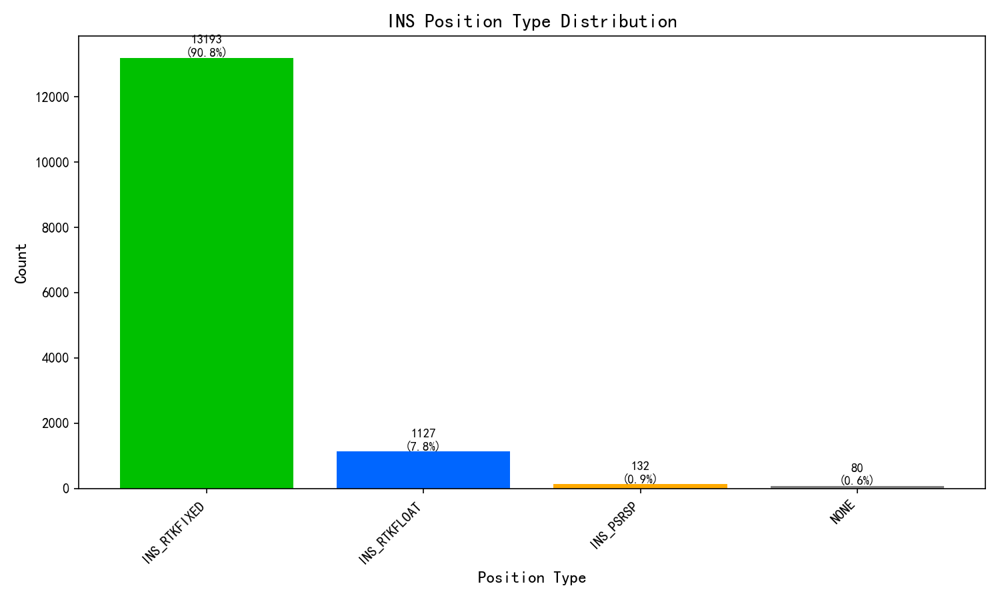

| 解类型 | 数量 | 占比 |
|--------|------|------|
| INS_RTKFIXED | 13193 | 90.8% |
| INS_RTKFLOAT | 1127 | 7.8% |
| INS_PSRSP | 132 | 0.9% |
| NONE | 80 | 0.6% |

**INS固定解比率**: 90.8%

## 5. 卫星数量分析

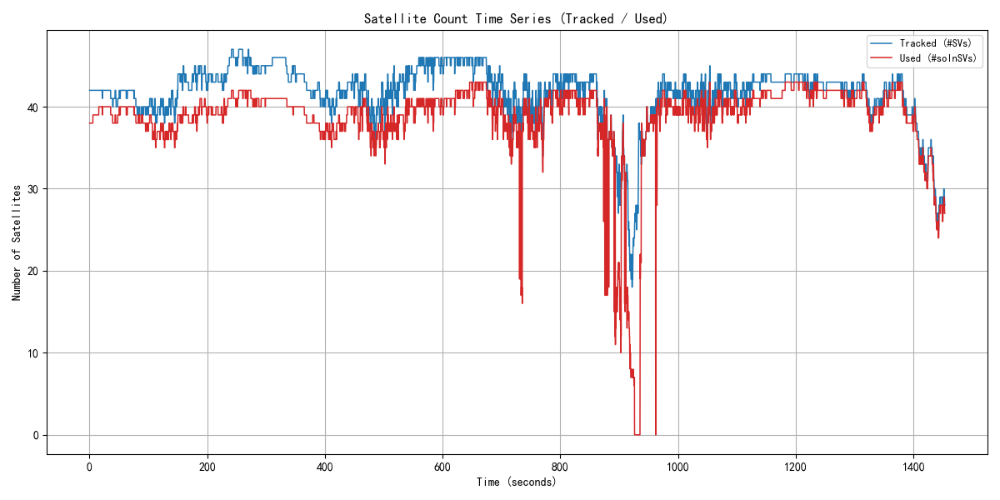

| 指标 | 平均 | 最小 | 最大 | 口径依据(UG016手册) |
|------|------|------|------|----------------------|
| 跟踪卫星数 | 41.6 | 18 | 47 | BESTGNSSPOSA #SVs跟踪到的卫星数(UG016 4.2.2字段15) |
| 可用卫星数 | 38.8 | 6 | 43 | BESTGNSSPOSA #solnSVs参与解算的卫星数(UG016 4.2.2字段16) |

> 两层关系: 跟踪 >= 可用。

        
## 6. DOP分析

**数据源:** $GPGSA(系统组合)

> DOP为接收机本地解算的几何精度因子(非卫星下发), 取决于卫星几何分布。

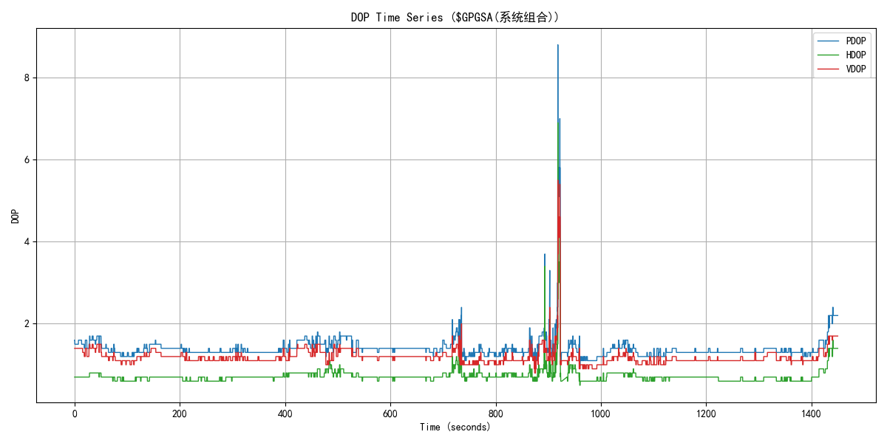

| 指标 | 数值 | 评估 |
|------|------|------|
| 平均PDOP | 1.40 | - |
| 最小PDOP | 1.00 |  |
| 最大PDOP | 8.80 |  |
| 平均HDOP | 0.73 | 优秀 |
| 最小HDOP | 0.50 |  |
| 最大HDOP | 6.90 |  |
| 平均VDOP | 1.19 | - |
| 最小VDOP | 0.80 |  |
| 最大VDOP | 5.50 |  |

        
## 7. 速度分析

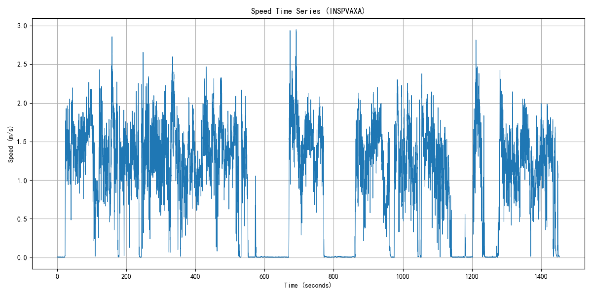

| 指标 | 数值 | 单位 |
|------|------|------|
| 平均速度 | 0.96 | m/s |
| 最大速度 | 2.95 | m/s |

        
## 8. 载噪比 C/N0 分析（特色：TRACKSTATA）

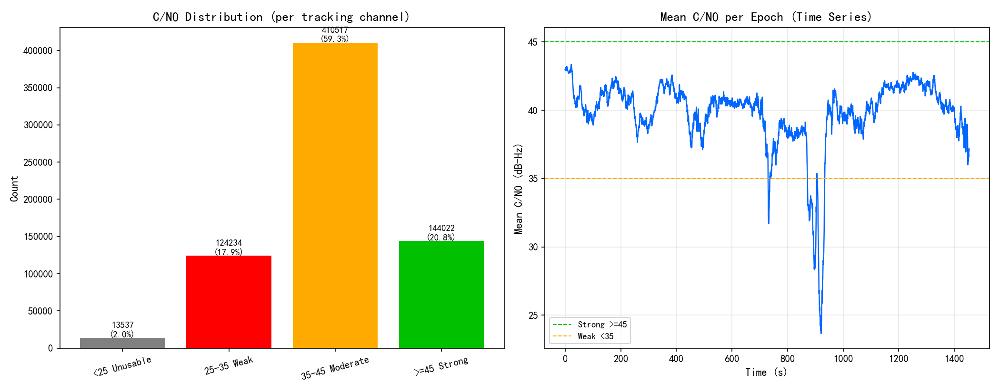

| 指标 | 数值 | 说明 |
|------|------|------|
| 数据来源 | TRACKSTATA | 通道跟踪状态, 逐跟踪通道给出载噪比, 及时性好 |
| 统计历元数 | 7267 | 参与统计的观测历元 |
| 观测值总数 | 692310 | 全部通道的C/N0样本数 |
| 平均C/N0 | 40.1 dB-Hz | 越高信号越好 |
| 中位数C/N0 | 42.0 dB-Hz | 抗离群值, 反映典型水平 |
| 范围 | 14 ~ 53 dB-Hz | 最低/最高观测值 |
| 低C/N0(<35)占比 | 19.9% | 占比越高遮挡/多路径越明显 |

**解读指导(行业共识, 见 Kaplan《Understanding GPS》)**: C/N0(载噪比)衡量卫星信号质量, 单位 dB-Hz, 越高越好。一般判据: **≥45** 信号强(开阔天空); **35~45** 中等(正常可用); **<35** 偏弱, 易受遮挡/多路径影响; 接收机跟踪门限约 **25~28**, 低于此值易失锁。

**怎么看图**: 上图分布直方图按阈值着色(绿=强/黄=中/红=弱), 绿色占比越高越好; 下图历元平均C/N0时间序列若某时段明显下坠, 说明该时段存在遮挡(楼宇/树荫/隧道)或强多路径。分布直方图左偏(低值尾巴长)或时间序列出现深坑, 都提示观测环境欠佳。

        
## 9. 位置分析

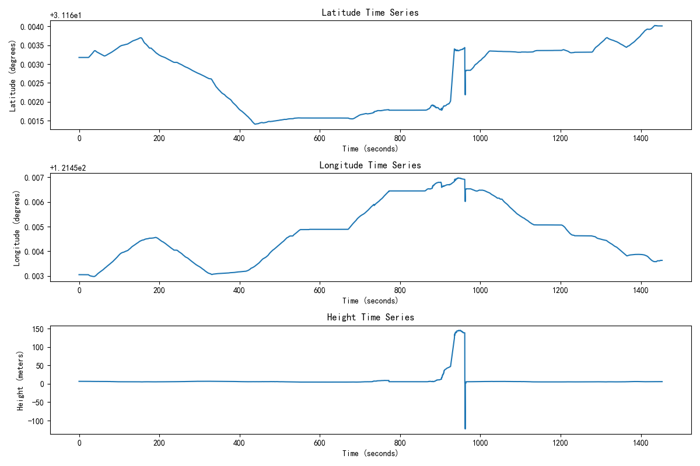

位置时间序列显示了接收机在Kinematic环境下的位置变化。从图中可以观察到位置的连续性和稳定性。

### 9.1 GNSS轨迹分析（ENU坐标）

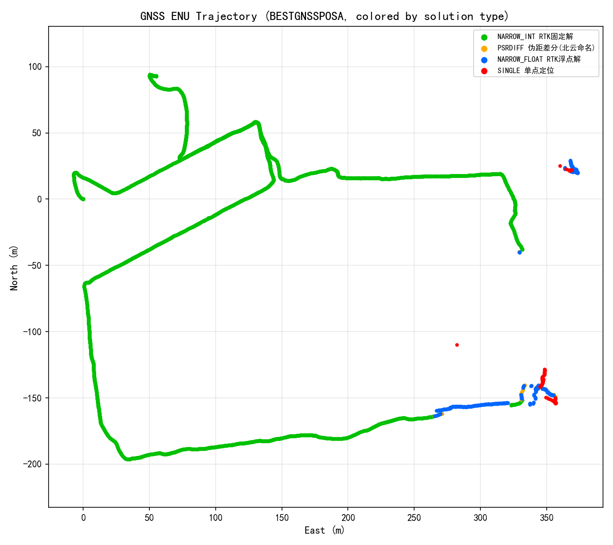

GNSS轨迹图使用ENU（East-North-Up）坐标系显示，按数据实际出现的解类型动态着色（本设备GNSS解类型见上分布图；不同产品命名可能有差异，如伪距差分北云称PSRDIFF、华测称SPPDIFF，含义相同）：绿色=RTK固定解(NARROW_INT)，蓝色=浮点解(NARROW_FLOAT)，红色=单点(SINGLE)，橙色=伪距差分(PSRDIFF/SPPDIFF)，紫色=PPP，灰色=无解(NONE)。图例中标注各类型数量及中文名。

### 9.2 INS轨迹分析（ENU坐标）

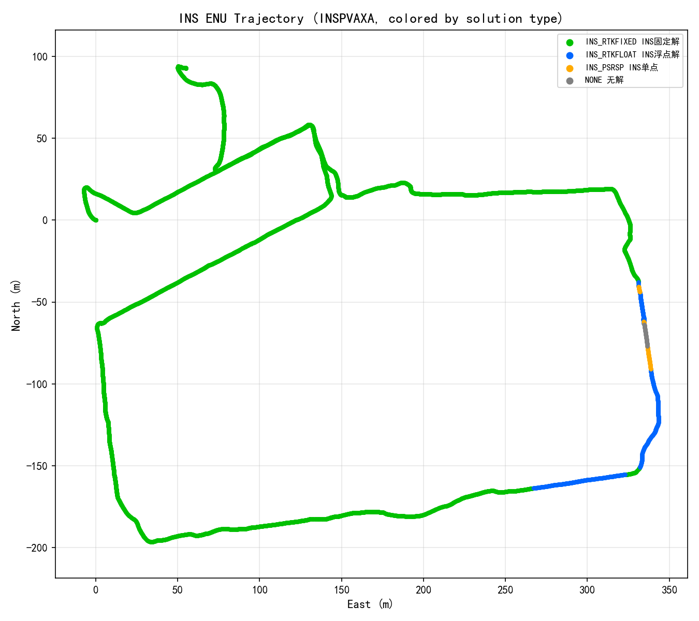

INS轨迹图使用ENU坐标系显示，组合惯导系统的定位轨迹。颜色对应：绿色(INS_RTKFIXED)、橙色(INS_RTKFLOAT)、蓝色(INS_PSRSP)、黄色(INS_PSRDIFF)、灰色(NONE)。

### 9.3 GNSS与INS轨迹对比

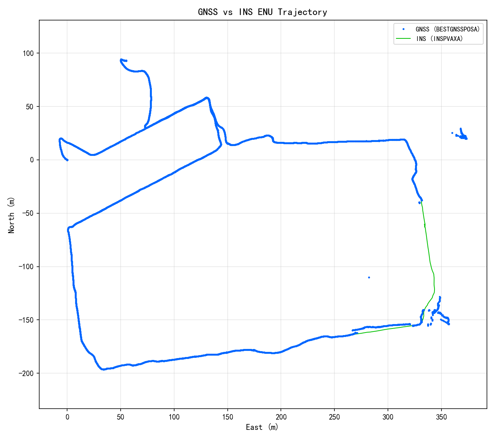

该图展示了GNSS纯定位轨迹（蓝色）与INS组合导航轨迹（红色）的叠加对比，可以分析两者之间的一致性和差异。

### 9.4 BESTGNSSPOSA解算状态时间序列

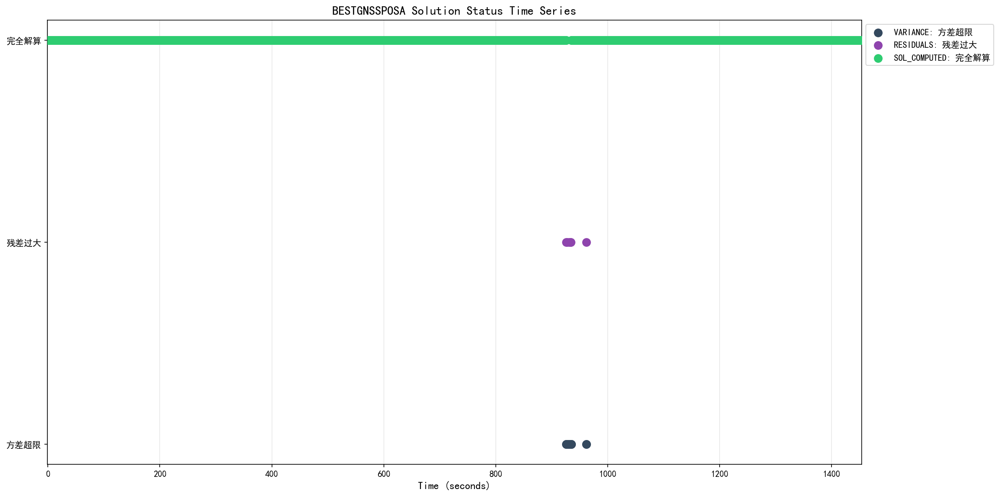

该图展示了BESTGNSSPOSA报文中解算状态（sol stat）的时间序列变化，帮助分析定位过程中解算状态的稳定性。

## 10. 结论与建议

### 评估结果

| 评估指标 | 状态 | 说明 |
|---------|------|------|
        | GNSS固定解比率 | 警告 | 90.8%，基本满足要求 |
| INS固定解比率 | 警告 | 90.8%，基本满足要求 |
| 卫星数(跟踪/参与解算) | 通过 | 平均跟踪41.6颗，平均参与解算38.8颗，良好 |
| DOP值 | 通过 | 平均HDOP 0.73，优秀 |

### 特色指标(设备专有字段)

以下为该设备特有的字段/能力评估, 每项附注释及依据。

| 特色指标 | 实测值 | 评级 | 注释(判断动态的什么/好坏) | 依据 |
|---------|--------|------|--------------------------|------|
| 载体姿态 | 横滚2.79° 俯仰-0.02° 航向170.24° | 提示 | 组合惯导特色: 实时输出Kinematic载体姿态(横滚/俯仰/航向)。纯GNSS无此能力。姿态连续性反映惯导跟踪状态。 | 北云UG016 INSPVAX字段 |
| 水平位置精度σ | 0.015 m | 通过 | 组合惯导特色: 位置标准差(接收机自估)。<=0.02m厘米级, 0.02~0.1m分米级, >0.1m米级。 | 北云UG016 INSPVAX字段(阈值为工程经验) |
| 航向角精度σ | 0.159 deg | 警告 | 组合惯导特色: 航向角标准差, 判断姿态收敛。<=0.1deg高, 0.1~0.5一般, >0.5发散。 | 北云UG016 INSPVAX字段(阈值为工程经验) |

### 建议

1. 保持良好的卫星信号接收环境，确保天线无遮挡
2. 定期检查RTK基准站连接状态
3. 对于Kinematic应用，建议使用组合导航系统提高定位稳定性
4. 根据应用场景调整采样率，平衡精度和数据量
        