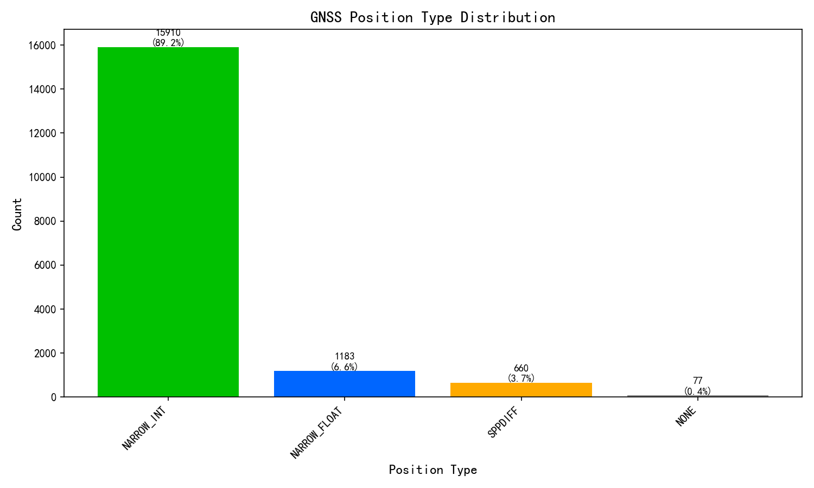
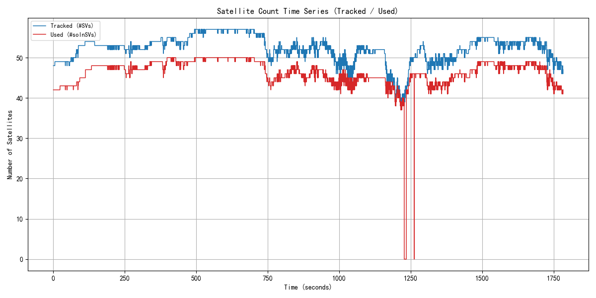
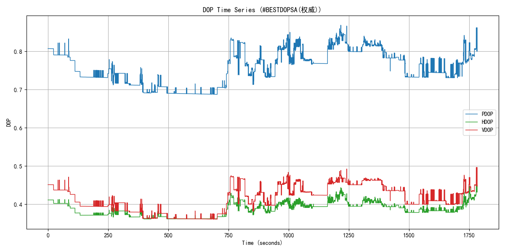
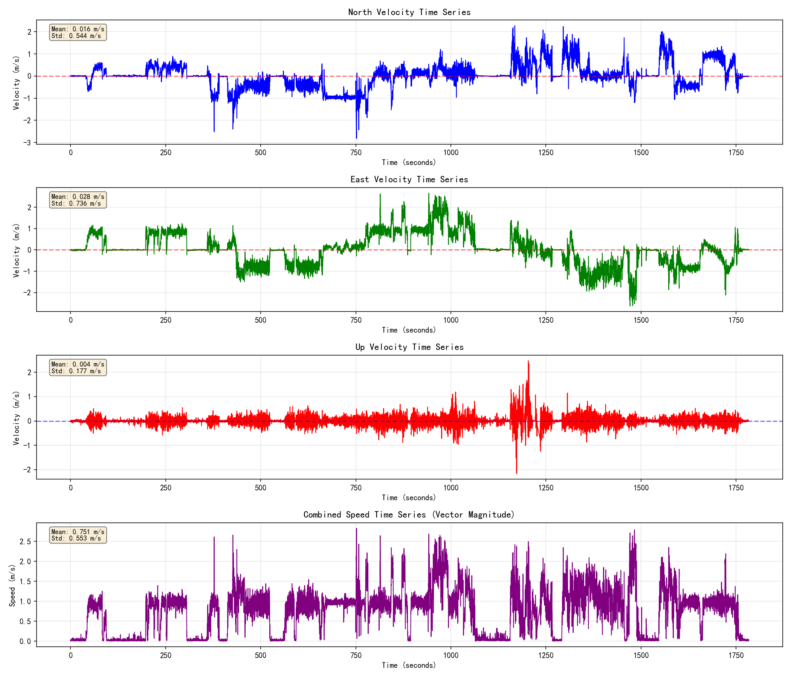
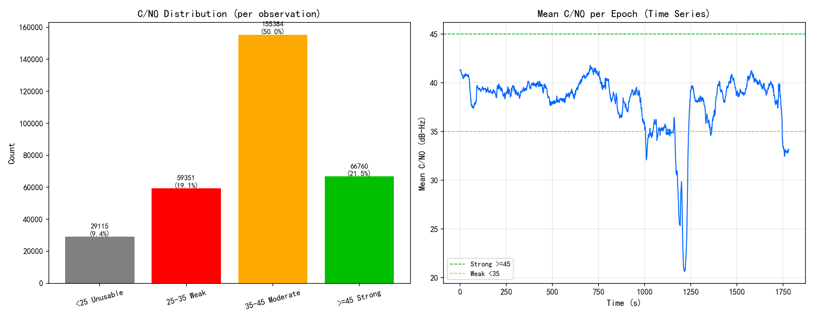
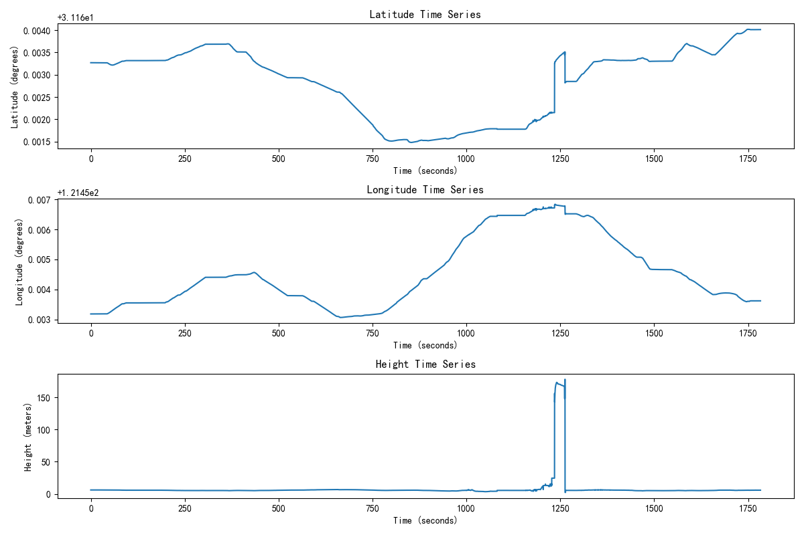
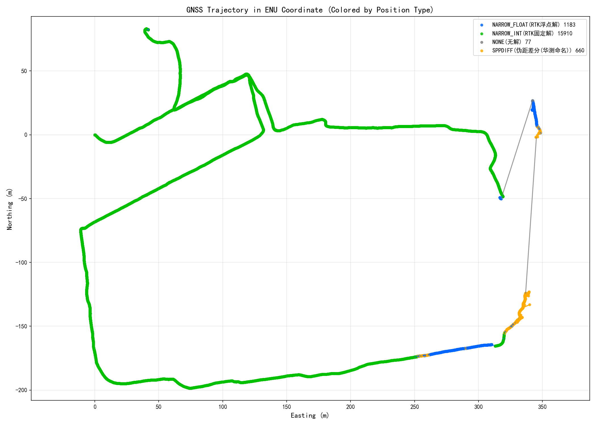
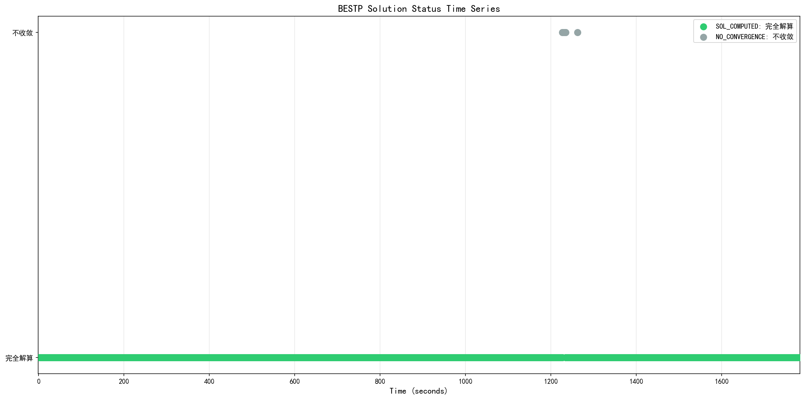

# GPS/RTK Kinematic定位分析报告【华测 HUACE · 纯GNSS】

## 基本信息
- **分析输入(COM1/ASCII)**: 0916星扬上午.log
- **生成时间**: 2026-09-17 19:24:47
- **分析工具**: 华测 HUACE Kinematic Analyzer

## 1. 数据概览

| 报文类型 | 数量 | 占比 |
|---------|------|------|
        | #BESTPA | 17830 | 3.3% |
| $GNGGA | 17830 | 3.3% |
| #BESTVA | 17830 | 3.3% |
| #RTKPA | 17830 | 3.3% |
| #RTKVA | 17830 | 3.3% |
| #ENVSTATUSA | 17830 | 3.3% |
| $GPGSV | 60860 | 11.1% |
| $GLGSV | 36887 | 6.7% |
| $GAGSV | 52520 | 9.6% |
| $GBGSV | 78232 | 14.3% |
| $GQGSV | 34528 | 6.3% |
| $GIGSV | 17333 | 3.2% |
| $GNGSA | 106390 | 19.4% |
| $GNGST | 17830 | 3.3% |
| #BESTDOPSA | 17830 | 3.3% |
| #BESTPOSA | 1783 | 0.3% |
| #RANGEA | 1783 | 0.3% |
| #SATVIS2A | 14264 | 2.6% |
| # | 2 | 0.0% |
| #j|B | 1 | 0.0% |
| < | 8 | 0.0% |
| <0X^ | 1 | 0.0% |
| <4H | 1 | 0.0% |
| #O\ | 1 | 0.0% |
| $ | 1 | 0.0% |
| #X | 1 | 0.0% |
| $`=`x`kC1 | 1 | 0.0% |
| $DG | 1 | 0.0% |
| <![p0B | 1 | 0.0% |

**数据完整性**: 547239 条有效报文(原始 562881 行, 乱码残片 2910 行)

        
## 2. 完整性检查与报文周期核对(COM1配置)

| 报文 | 实测头 | 条数 | 设定周期(s) | 实际周期(s) | 实际频率(Hz) | 丢帧率 | 状态 | 备注 |
|------|--------|------|------------|------------|-------------|--------|------|------|
| GGA | $GNGGA | 17830 | 0.100 | 0.100 | 10.00 | 0.0% | 🟢正常 | - |
| GSV | $GPGSV,$GLGSV,$GAGSV,$GBGSV,$GQGSV,$GIGSV | 280360 | 0.100 | - | - | - | 🟢正常 | 无可用时间戳, 按报文插入规律推断(以实测数据为准) |
| GST | $GNGST | 17830 | 0.100 | 0.100 | 10.00 | 0.0% | 🟢正常 | - |
| GSA | $GNGSA | 106390 | 0.100 | - | - | - | 🟢正常 | 无可用时间戳, 按报文插入规律推断(以实测数据为准) |
| BESTDOPSA | #BESTDOPSA | 17830 | 0.100 | 0.100 | 10.00 | 0.0% | 🟢正常 | - |
| BESTPA | #BESTPA | 17830 | 0.100 | 0.100 | 10.00 | 0.0% | 🟢正常 | - |
| RTKPA | #RTKPA | 17830 | 0.100 | 0.100 | 10.00 | 0.0% | 🟢正常 | - |
| RTKVA | #RTKVA | 17830 | 0.100 | 0.100 | 10.00 | 0.0% | 🟢正常 | - |
| BESTVA | #BESTVA | 17830 | 0.100 | 0.100 | 10.00 | 0.0% | 🟢正常 | - |
| ENVSTATUSA | #ENVSTATUSA | 17830 | 0.100 | 0.100 | 10.00 | 0.0% | 🟢正常 | - |

> ⚠️ 加粗标色项表示实际报文周期与设定周期可能不符或报文缺失, 请核对设备输出配置。

**采样率分析**: 10.00 Hz (平均间隔: 0.100 秒)

        
**RTK链路**: 基站ID 1793 (核对1783次) ／ 差分龄期 平均1.13s, 最大16.00s

        
## 3. GNSS解类型分析

| 解类型 | 数量 | 占比 |
|--------|------|------|
| NARROW_INT | 15910 | 89.2% |
| NARROW_FLOAT | 1183 | 6.6% |
| SPPDIFF | 660 | 3.7% |
| NONE | 77 | 0.4% |

**GNSS固定解比率**: 89.2%

## 4. 卫星数量分析

| 指标 | 平均 | 最小 | 最大 | 口径依据(M7手册) |
|------|------|------|------|----------------------|
| 跟踪卫星数 | 52.2 | 38 | 57 | #SVs跟踪到的卫星数(M7手册BESTP字段15/p83) |
| 可用卫星数 | 46.4 | 37 | 50 | #solnSVs参与解算的卫星数(M7手册BESTP字段16/p84) |

> 两层关系: 跟踪 >= 可用。

        
## 5. DOP分析

**数据源**: PDOP/HDOP=#BESTDOPSA, VDOP=$GNGSA(同频混合)（DOP为接收机本地解算的几何精度因子，非卫星下发；多星座取组合DOP，星座越多DOP越小）

> #BESTDOPSA不含VDOP(表3-36: PDOP/GDOP/HDOP/TDOP/HTDOP); VDOP取自$GNGSA(表3-3第7字段=垂直精度因子)。两报文同为10Hz同频, 且PDOP/HDOP数值同源(GSA为1位小数舍入版), 故按字段混合使用。

| 指标 | 数值 | 评估 |
|------|------|------|
| 平均PDOP | 0.76 |  |
| 最小PDOP | 0.69 | |
| 最大PDOP | 0.87 | |
| 平均HDOP | 0.39 | 优秀 |
| 最小HDOP | 0.36 | |
| 最大HDOP | 0.45 | |
| 平均VDOP | 0.65 |  |
| 最小VDOP | 0.60 | |
| 最大VDOP | 0.80 | |
| 平均GDOP | 0.86 |  |
| 最小GDOP | 0.78 | |
| 最大GDOP | 1.00 | |
| 平均TDOP | 0.42 |  |
| 最小TDOP | 0.36 | |
| 最大TDOP | 0.50 | |
| 平均HTDOP | 0.80 |  |
| 最小HTDOP | 0.72 | |
| 最大HTDOP | 0.95 | |

        
## 6. 速度分析

| 指标 | 数值 | 单位 |
|------|------|------|
| 平均速度 | 0.75 | m/s |
| 最大速度 | 2.83 | m/s |

        
## 7. 载噪比 C/N0 分析（特色：RANGEA）

| 指标 | 数值 | 说明 |
|------|------|------|
| 数据来源 | RANGEA | 原始观测值(伪距/载波/多普勒/载噪比), 华测独有采集 |
| 统计历元数 | 1783 | 参与统计的观测历元 |
| 观测值总数 | 310610 | 全部卫星/频点的C/N0样本数 |
| 平均C/N0 | 38.3 dB-Hz | 越高信号越好 |
| 中位数C/N0 | 40.6 dB-Hz | 抗离群值, 反映典型水平 |
| 范围 | 10 ~ 54 dB-Hz | 最低/最高观测值 |
| 低C/N0(<35)占比 | 28.5% | 占比越高遮挡/多路径越明显 |

**解读指导(行业共识, 见 Kaplan《Understanding GPS》)**: C/N0(载噪比)衡量卫星信号质量, 单位 dB-Hz, 越高越好。一般判据: **≥45** 信号强(开阔天空); **35~45** 中等(正常可用); **<35** 偏弱, 易受遮挡/多路径影响; 接收机跟踪门限约 **25~28**, 低于此值易失锁。

**怎么看图**: 上图分布直方图按阈值着色(绿=强/黄=中/红=弱), 绿色占比越高越好; 下图历元平均C/N0时间序列若某时段明显下坠, 说明该时段存在遮挡(楼宇/树荫/隧道)或强多路径。分布直方图左偏(低值尾巴长)或时间序列出现深坑, 都提示观测环境欠佳。

        
## 8. 位置分析

位置时间序列显示了接收机在Kinematic环境下的位置变化。从图中可以观察到位置的连续性和稳定性。

### 8.1 GNSS轨迹分析（ENU坐标）

GNSS轨迹图使用ENU（East-North-Up）坐标系显示，按数据实际出现的解类型动态着色（本设备GNSS解类型见上分布图；不同产品命名可能有差异，如伪距差分北云称PSRDIFF、华测称SPPDIFF，含义相同）：绿色=RTK固定解(NARROW_INT)，蓝色=浮点解(NARROW_FLOAT)，红色=单点(SINGLE)，橙色=伪距差分(PSRDIFF/SPPDIFF)，紫色=PPP，灰色=无解(NONE)。图例中标注各类型数量及中文名。

### 8.2 BESTP解算状态时间序列

该图展示了BESTP报文中解算状态（sol stat）的时间序列变化，帮助分析定位过程中解算状态的稳定性。

## 9. 结论与建议

### 评估结果

| 评估指标 | 状态 | 说明 |
|---------|------|------|
        | GNSS固定解比率 | 警告 | 89.2%，基本满足要求 |
| 卫星数(跟踪/参与解算) | 通过 | 平均跟踪52.2颗，平均参与解算46.4颗，良好 |
| DOP值 | 通过 | 平均HDOP 0.39，优秀 |

### 特色指标(设备专有字段)

以下为该设备特有的字段/能力评估, 每项附注释及依据。

| 特色指标 | 实测值 | 评级 | 注释(判断动态的什么/好坏) | 依据 |
|---------|--------|------|--------------------------|------|
| 环境质量分 | 69 分 | 警告 | 华测特色: 综合反映观测环境对定位的影响。>=85优秀, 60~84一般, <60不合格。 | 华测M7手册表3-51 |
| 平均载噪比SNR | 38 dB-Hz | 通过 | 华测特色: 信号强度, 判断遮挡程度。>=38开阔, 32~37半遮挡, <=31严重遮挡。 | 华测M7手册表3-51 |
| 卫星可视比率 | 80% | 通过 | 华测特色(移动站): 跟踪卫星数/理论可视卫星数。越高越好, 反映天空遮挡。 | 华测M7手册表3-51(阈值为工程经验) |
| 电离层活跃 | WEAK(轻微) | 通过 | 华测特色: 电离层扰动会加大RTK固定难度。QUIET/WEAK好, MODERATE及以上需关注。 | 华测M7手册表3-52 |

### 建议

1. 保持良好的卫星信号接收环境，确保天线无遮挡
2. 定期检查RTK基准站连接状态
3. 对于Kinematic应用，建议使用组合导航系统提高定位稳定性
4. 根据应用场景调整采样率，平衡精度和数据量
        